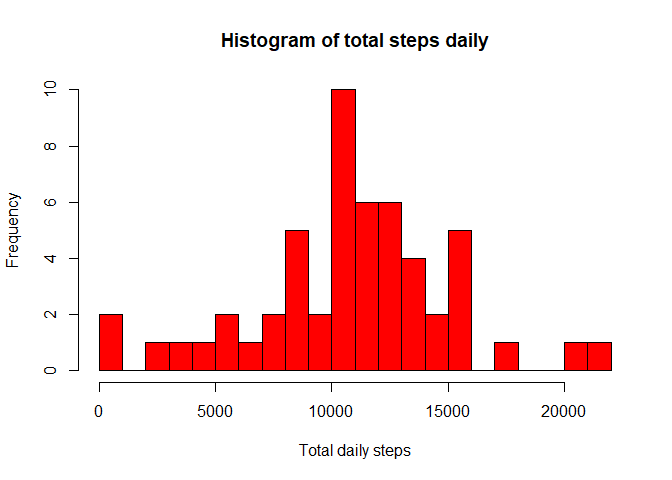
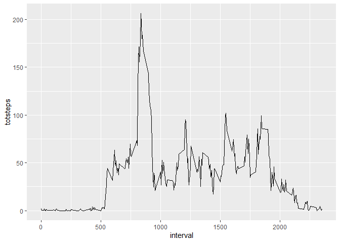
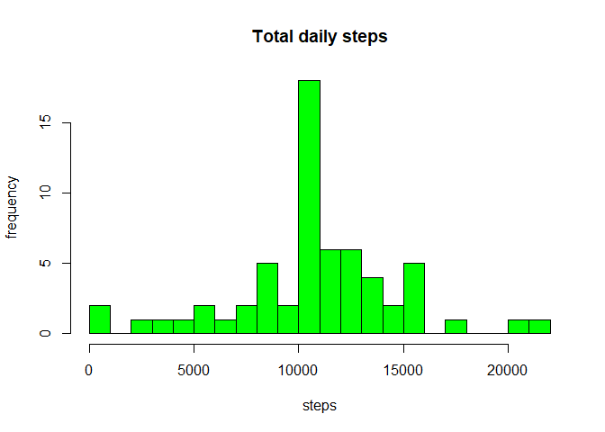
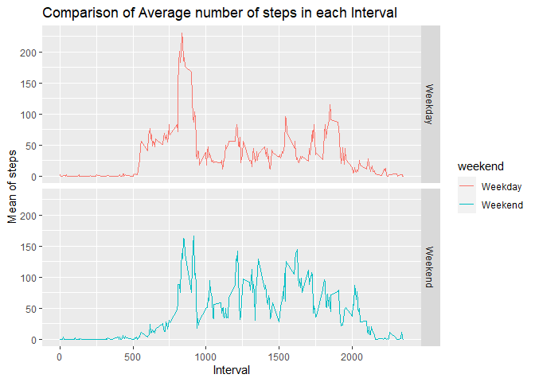

## Loading and preprocessing the data

```r
knitr::opts_chunk$set(echo = TRUE)
activitydata<- read.csv("activity.csv", header=TRUE)
head(activitydata)
```

```
##   steps       date interval
## 1    NA 2012-10-01        0
## 2    NA 2012-10-01        5
## 3    NA 2012-10-01       10
## 4    NA 2012-10-01       15
## 5    NA 2012-10-01       20
## 6    NA 2012-10-01       25
```


## What is mean total number of steps taken per day?

```r
knitr::opts_chunk$set(echo=TRUE)
library(magrittr)
library(dplyr)
```

```
## Warning: package 'dplyr' was built under R version 4.0.2
```

```
## 
## Attaching package: 'dplyr'
```

```
## The following objects are masked from 'package:stats':
## 
##     filter, lag
```

```
## The following objects are masked from 'package:base':
## 
##     intersect, setdiff, setequal, union
```

```r
actbydate<-activitydata%>%select(date,steps)%>%group_by(date)%>%summarize(totsteps=sum(steps))%>%na.omit()
```

```
## `summarise()` ungrouping output (override with `.groups` argument)
```

```r
hist(actbydate$totsteps, xlab="Total daily steps", ylab="Frequency", main="Histogram of total steps daily", breaks=20, col="red")
```

<!-- -->

```r
mean(actbydate$totsteps)
```

```
## [1] 10766.19
```

```r
median(actbydate$totsteps)
```

```
## [1] 10765
```


## What is the average daily activity pattern?

```r
library(ggplot2)
```

```
## Warning: package 'ggplot2' was built under R version 4.0.2
```

```r
intervaldata<-activitydata%>%select(interval,steps)%>%na.omit()%>%group_by(interval)%>%summarize(totsteps=mean(steps))
```

```
## `summarise()` ungrouping output (override with `.groups` argument)
```

```r
ggplot(intervaldata, aes(x=interval, y=totsteps))+geom_line()
```

<!-- -->

```r
intervaldata[which(intervaldata$totsteps== max(intervaldata$totsteps)),]
```

```
## # A tibble: 1 x 2
##   interval totsteps
##      <int>    <dbl>
## 1      835     206.
```


## Imputing missing values

```r
missingvals<- is.na(activitydata[,1])
meanrep<- function(x){replace(x, is.na(x), mean(x, na.rm=TRUE))}
meandata<- activitydata%>%group_by(interval)%>%mutate(steps=meanrep(steps))
head(meandata)
```

```
## # A tibble: 6 x 3
## # Groups:   interval [6]
##    steps date       interval
##    <dbl> <chr>         <int>
## 1 1.72   2012-10-01        0
## 2 0.340  2012-10-01        5
## 3 0.132  2012-10-01       10
## 4 0.151  2012-10-01       15
## 5 0.0755 2012-10-01       20
## 6 2.09   2012-10-01       25
```

```r
activitynew<- aggregate(meandata$steps, by=list(meandata$date), sum)
names(activitynew)[1]="date"
names(activitynew)[2]="totalsteps"
head(activitynew, 15)
```

```
##          date totalsteps
## 1  2012-10-01   10766.19
## 2  2012-10-02     126.00
## 3  2012-10-03   11352.00
## 4  2012-10-04   12116.00
## 5  2012-10-05   13294.00
## 6  2012-10-06   15420.00
## 7  2012-10-07   11015.00
## 8  2012-10-08   10766.19
## 9  2012-10-09   12811.00
## 10 2012-10-10    9900.00
## 11 2012-10-11   10304.00
## 12 2012-10-12   17382.00
## 13 2012-10-13   12426.00
## 14 2012-10-14   15098.00
## 15 2012-10-15   10139.00
```

```r
summary(activitynew)
```

```
##      date             totalsteps   
##  Length:61          Min.   :   41  
##  Class :character   1st Qu.: 9819  
##  Mode  :character   Median :10766  
##                     Mean   :10766  
##                     3rd Qu.:12811  
##                     Max.   :21194
```

```r
hist(activitynew$totalsteps, xlab="steps", ylab="frequency", main="Total daily steps", breaks=20, col="green")
```

<!-- -->

```r
oldmean<- mean(actbydate$totsteps, na.rm=TRUE)
newmean<- mean(activitynew$totalsteps)
oldmean
```

```
## [1] 10766.19
```

```r
newmean
```

```
## [1] 10766.19
```

```r
oldmedian<- median(actbydate$totsteps, na.rm=TRUE)
newmedian<- median(activitynew$totalsteps)
oldmedian
```

```
## [1] 10765
```

```r
newmedian
```

```
## [1] 10766.19
```
## No change in mean but the median has moved by a bit, that is the value has increased a little.


## Are there differences in activity patterns between weekdays and weekends?

```r
meandata$date<- as.Date(meandata$date)
meandata$weekday<- weekdays(meandata$date)
meandata$weekend<- ifelse(meandata$weekday=="Saturday"|meandata$weekday=="Sunday", "Weekend", "Weekday")
library(ggplot2)
meandayend<- aggregate(meandata$steps, by=list(meandata$weekend, meandata$interval), na.omit(mean))
names(meandayend)<- c("weekend", "interval", "steps")
ggplot(meandayend, aes(x=interval, y=steps, color=weekend))+geom_line() +facet_grid(weekend~.)+ xlab("Interval")+ ylab("Mean of steps")+ ggtitle("Comparison of Average number of steps in each Interval")
```

<!-- -->

